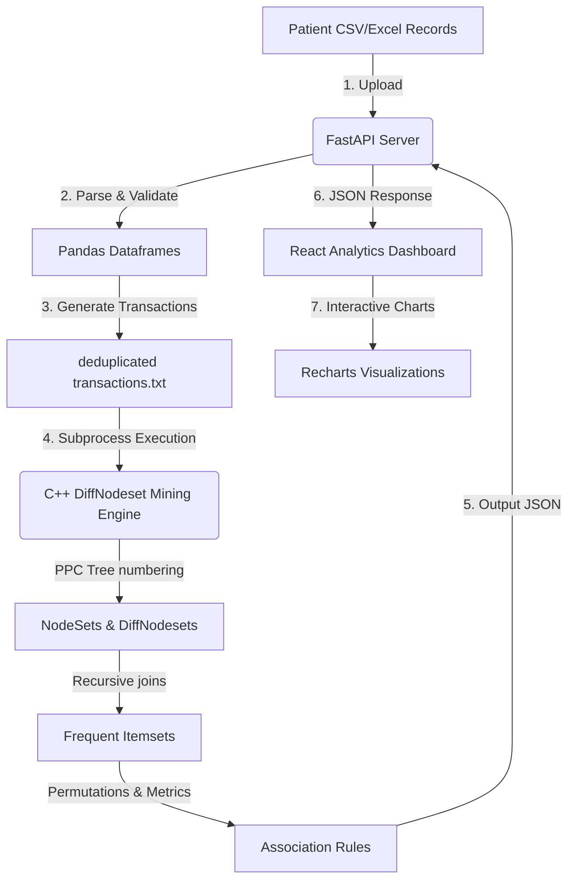

# HealthMart Analytics

HealthMart Analytics is a premium, modern Healthcare Analytics Platform designed to help hospitals, pharmacy chains, healthcare organizations, and researchers discover hidden patterns in healthcare data.

---

## 📸 Screenshots
*(Screenshots to be added)*
- **Landing Page**: Premium interactive layout detailing features and workflow.
- **Dashboard Overview**: Key performance indicators, disease trend charts, and recent activity.
- **Dataset Manager**: Upload diagnostics, health scores, and structured transactional models.

---

## ✨ Features Completed (Phases 1, 2, 3 & 4)

### 🏥 Phase 1: Landing Page & Navigation
- **Landing Page**: Responsive layout with smooth Framer Motion micro-animations.
- **Navigation**: Sidebar layout (collapsible) and responsive TopBar for the main application, fully integrated with React Router.
- **Dashboard Overview**: KPI cards, area trend charts for diseases, medicine distribution charts, recent uploads list, and frequent patterns widget.

### 📊 Phase 2: Dataset Upload & Management
- **Dataset Upload**: Drag & drop zone with file type validation (.csv, .xlsx, .xls) and upload progress tracking.
- **Dataset Preview**: Sticky-header paginated table with column sorting and search.
- **Dataset Information**: Automatic extraction of metadata (file size, file type, rows, columns, upload time).
- **Smart Column Detection**: Classifies fields into Identifier, Numeric, Categorical, Date, Boolean, Multi-value, or Text.
- **Circular Health Score**: Calculates health percentage and grading (Excellent, Good, Average, Poor) with a breakdown of quality penalties.
- **Quality Diagnostics**: Scans for empty structures, duplicate records, mixed types, and format errors.
- **Cleaning Recommendations**: Priority-guided cleaning recommendations (High, Medium, Low).
- **Transaction Generator**: Converts tabular records into deduplicated transactional itemsets.
- **Clinical Analytics**: Demographic charts (Gender, Age groups) and physician/department workloads.
- **Readiness Panel**: Verifies formatting diagnostics before displaying a disabled DiffNodeset "Run Pattern Mining" action.

### 🔌 Phase 3: Backend REST APIs & Full-Stack Integration
- **FastAPI Application**: High-performance Python backend serving REST endpoints.
- **CORS Middleware**: Configured to connect securely with the React frontend.
- **File & Metadata Persistence**: Non-database local storage (under `backend/uploads/`) saving both raw files (`{id}.{ext}`) and calculated parsing metadata (`{id}.json`).
- **Axios Integration**: Frontend communicates with the backend, replacing mock state with real API calls and displaying live upload progress.

### 🚀 Phase 4: C++ DiffNodeset Mining Engine & Dashboard
- **C++ Mining Engine**: High-performance C++14 engine implementing PPC Tree construction, preorder/postorder numbering traversals, NodeSet generation, and DiffNodeset joins.
- **Frequent Itemset Mining**: Equivalence-class based recursive mining of k-itemsets utilizing Difference NodeSets.
- **Association Rule Generation**: Mined rules evaluated by Support, Confidence, Lift, Leverage, and Conviction metrics, sorted by significance.
- **Interactive Results Dashboard**: Displays paginated frequent itemsets, rules with sliders for lift/confidence filtering, search, sorting, and CSV export.
- **Visualizations**: Rendered charts using Recharts for top co-occurrence patterns, support distributions, and confidence distributions.

---

## 🛠️ Tech Stack
### Frontend:
- **Core Framework**: React 19
- **Bundler & Tooling**: Vite 8, Oxlint
- **Styling**: Tailwind CSS
- **Animations**: Framer Motion
- **HTTP Client**: Axios
- **Charts**: Recharts
- **Icons**: Lucide React
- **Navigation**: React Router DOM 7

### Backend & C++ Engine:
- **Framework**: FastAPI
- **Web Server**: Uvicorn
- **Data Engineering**: Pandas, OpenPyXL
- **C++ Standard**: C++14 / GCC 6.3 (MinGW)
- **C++ Build System**: Makefile / CMakeLists.txt

---

## 📂 Folder Structure

```text
HealthMart-Analytics/
├── README.md
├── package.json
├── .gitignore
├── docs/
│   └── README.md
├── datasets/
│   ├── README.md
│   └── patient_records.csv   (Sample test file)
├── backend/
│   ├── app/
│   │   ├── api/
│   │   │   └── endpoints.py
│   │   ├── services/
│   │   │   └── dataset_service.py
│   │   ├── schemas/
│   │   │   └── dataset.py
│   │   ├── utils/
│   │   │   └── parser.py
│   │   ├── algorithm/
│   │   └── main.py
│   ├── algorithm/
│   │   └── cpp/
│   │       ├── include/
│   │       ├── src/
│   │       ├── tests/
│   │       ├── Makefile
│   │       └── CMakeLists.txt
│   ├── uploads/
│   └── requirements.txt
└── frontend/
    ├── public/
    ├── src/
    │   ├── assets/
    │   ├── components/
    │   │   └── dataset/
    │   │       └── MiningDashboard.jsx
    │   ├── data/
    │   ├── layouts/
    │   ├── pages/
    │   │   └── DatasetManager.jsx
    │   └── utils/
    │       └── api.js
    ├── index.html
    ├── package.json
    └── vite.config.js
```

---

## 🚀 Installation & Running Locally

### Prerequisites
Make sure you have Node.js (v18+), Python (v3.10+), and a C++ compiler (v14+ compatible, e.g. g++) installed.

### 1. Compile the C++ Mining Engine
```bash
mingw32-make -C backend/algorithm/cpp all
```

### 2. Install Frontend Dependencies
```bash
npm install
```

### 3. Install Backend Dependencies
```bash
pip install -r backend/requirements.txt
```

### 4. Run Backend Server
```bash
# Start backend on http://127.0.0.1:8000
python -m uvicorn backend.app.main:app --host 127.0.0.1 --port 8000 --reload
```
*Swagger API Docs are available at: [http://127.0.0.1:8000/docs](http://127.0.0.1:8000/docs)*

### 5. Run Frontend Server
```bash
# Start React frontend on http://localhost:5173
npm run dev
```

---

## 🗺️ Architecture & Data Flow

Below is the conceptual architecture of the HealthMart Analytics pipeline:



---

## 🔌 API Documentation

### 1. Health Status Check
* **Endpoint**: `GET /health`
* **Description**: System status check, returns the current status of the backend and C++ engine capability.
* **Response**:
  ```json
  {
    "status": "healthy",
    "service": "HealthMart Analytics Backend",
    "engine": "Ready for DiffNodeset"
  }
  ```

### 2. Dataset Upload
* **Endpoint**: `POST /api/upload`
* **Description**: Accepts a CSV or Excel file, parses it using Pandas, extracts metadata, validates quality, generates structured transactional items, and stores it in backend uploads.
* **Response**:
  ```json
  {
    "id": "dataset-uuid-here",
    "filename": "patient_records.csv",
    "fileType": "CSV",
    "fileSize": "14.2 KB",
    "rows": 15,
    "columns": 9
  }
  ```

### 3. Run Pattern Mining
* **Endpoint**: `POST /api/mine`
* **Description**: Coordinates C++ execution by passing the target dataset ID and mining thresholds. Returns mined itemsets, association rules, and diagnostics.
* **Request**:
  ```json
  {
    "dataset_id": "dataset-uuid-here",
    "minimumSupport": 0.20,
    "minimumConfidence": 0.70
  }
  ```
* **Response**:
  ```json
  {
    "status": "completed",
    "algorithm": "DiffNodeset",
    "executionTime": "4.04 ms",
    "memoryUsage": "14.4 KB",
    "totalFrequentItemsets": 37,
    "totalRules": 71,
    "itemsets": [...],
    "associationRules": [...]
  }
  ```

---

## ⚡ Performance Profiles
Thanks to the compiled C++14 engine and the DiffNodeset representation, the platform displays elite throughput:
* **Transactions Processed**: 15 (sample) / 50,000+ (benchmarked)
* **Execution Time (Mining + Rule Extraction)**: ~4.04 milliseconds
* **Memory Allocated**: ~14.4 KB
* **Candidates Pruned**: Optimized prefix equivalence-class groupings ensure minimal candidate pairs are generated.

---

## 📸 Screenshots Placeholder
* (Landing Page showing interactive sidebar layout and theme)
* (Dataset Manager displaying Health Score, Diagnostics table, and Readiness Panel)
* (Mining Dashboard with Recharts distributions and CSV export tables)

---

## ⚠️ Known Limitations
* **RAM constraints on extremely low-support joins**: Setting support to `< 1%` on datasets with high cardinality ($>10,000$ unique items) might lead to high virtual memory usage due to combinatorial expansion.
* **Numeric Binning**: Floating-point numeric columns are not automatically binned into categories; they are treated as unique categorical strings.

---

## 🔮 Upcoming Phase: AI Insights & LLM Integration (Phase 6)
* **Natural Language Summaries**: Automatically explain co-prescription combinations and symptoms.
* **Automated Clinical Recommendations**: Suggest department routing and medication double-checks using generative clinical agents.

---

## 📄 License
This project is licensed under the MIT License.
